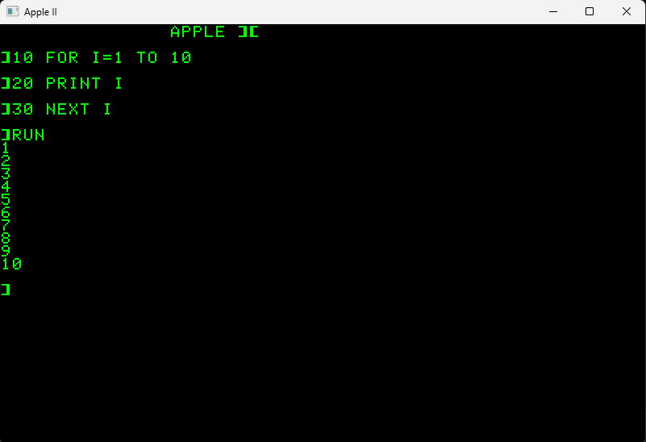

# apple2-odin

An Apple II emulator written from scratch in [Odin](https://odin-lang.org/).

> **Source code is currently private while the project is in its early
> development stages.**
>
> This repository documents the project, its progress and its goals.

## About the project

This project started as a personal challenge: learn Odin, rediscover the
Apple II from the inside, and understand how an emulator actually works by
building one step at a time.

I have known and used the Apple II for about 40 years.

Building an emulator is turning out to be a surprisingly good way to discover
how much I still didn't know about it.

In a way, I knew this machine for forty years.

I'm now discovering that I didn't know it nearly as well as I thought.

The project is intentionally developed incrementally, usually in small
sessions of around one hour.

The objective is not to build an emulator as quickly as possible, but to
understand the machine while building it.

**The journey is really the point.**

## Current status

The emulator can now boot a real Apple II ROM and run Applesoft BASIC
interactively in an SDL3 window.



*The original Apple II ROM running Applesoft BASIC interactively in
apple2-odin. The BASIC program, keyboard handling, execution and text output
are all handled by the emulated machine.*

For example, programs can be entered and executed directly:

```basic
]10 FOR I = 1 TO 10
]20 PRINT I
]30 NEXT I
]RUN
1
2
3
4
5
6
7
8
9
10
]
```

The display is rendered using the original Apple II character generator ROM
(341-0036), including normal, inverse and flashing characters.

The emulator is already using original Apple II hardware mechanisms such as
the keyboard soft switches and PAGE1/PAGE2 video selection.

The NMOS 6502 core currently implements **all 151 official opcode
variants**.

## What is already working

- NMOS 6502 CPU emulation
- All 151 official NMOS 6502 opcode variants
- CPU registers, flags and stack
- Multiple 6502 addressing modes
- Apple II memory and bus
- ROM loading and RESET vector handling
- Boot of a real Apple II ROM
- Applesoft BASIC
- Apple II keyboard soft switches
- Interactive PC keyboard input
- 40×24 Apple II text display
- Original Apple II character generator ROM
- Normal, inverse and flashing text
- PAGE1 / PAGE2 video selection
- Apple II video soft switches
- SDL3 interactive frontend
- BASIC program execution and screen scrolling

## Architecture

The emulation core is deliberately kept independent from the host frontend.

```text
Physical keyboard
       │
       ▼
      SDL3
       │
       ▼
+------------------+
|     Apple II     |
|                  |
| Memory / Bus     |
| ROM              |
| Keyboard I/O     |
| Video state      |
| Text video       |
+--------+---------+
         │
         ▼
+------------------+
|       6502       |
|                  |
| Registers        |
| Instructions     |
| Addressing modes |
| Flags / Stack    |
+------------------+
```

The 6502 core does not know that it is running inside an Apple II, and the
Apple II emulation contains no SDL-specific logic.

Keeping these layers separate should make other frontends and platforms
possible later.

For now, however, **Windows is the primary development platform**.

## Milestone #1 — From nothing to "HI"

The first milestone was getting enough of the 6502 running to execute a small
program and produce recognizable output.

```text
HI
```

It wasn't much.

But it was the first time the CPU I was building actually did something
recognizable.

## Milestone #2 — From "HI" to "APPLE ]["

The next major milestone was very different.

The emulator reached the point where it could start executing the original
Apple II ROM from its RESET vector.

Eventually, this appeared:

```text
APPLE ][
```

This time I didn't write the message.

**The original Apple II ROM did.**

Soon afterwards, the Applesoft prompt appeared and the machine became
interactive.

That was the point where the project started to feel less like a CPU
experiment and more like an Apple II.

## Authentic Apple II text

The initial SDL frontend deliberately used a temporary host-side debug font.

It has since been replaced by rendering based on the original Apple II
character generator ROM (341-0036).

The emulator now decodes the character stored in Apple II text memory,
determines its display attribute and renders the corresponding character ROM
bitmap.

Normal, inverse and flashing characters are supported.

Text PAGE1 and PAGE2 selection is also part of the emulated machine state and
can be controlled through the original Apple II soft switches at `$C054` and
`$C055`.

## Where it goes next

With **all 151 official NMOS 6502 opcode variants now implemented**, the next
step is not adding more instructions, but making the CPU more faithful.

That means checking some of the less obvious NMOS 6502 behaviors and preparing
the core for proper timing.

Then comes more of the actual Apple II hardware:

- remaining video soft switches
- TEXT / GRAPHICS switching
- MIXED mode
- Lo-Res graphics
- Hi-Res graphics
- Disk II
- DOS 3.3
- CPU timing and ~1 MHz synchronization
- speaker
- joystick / paddles
- color artifacting

The exact order may change as real software starts exposing missing pieces of
the machine.

## The next big milestone

One of the first major goals is to boot **DOS 3.3** and run a real Apple II
assembler such as **Merlin**.

The moment I can:

```text
Boot DOS 3.3
      │
      ▼
Run Merlin
      │
      ▼
Write 6502 code
      │
      ▼
Assemble it
      │
      ▼
Run it on the emulated Apple II
```

will be an important milestone.

At that point, the emulator will no longer just run software.

It will be able to run the tools used to **create Apple II software**.

## Compatibility targets

The first major game compatibility target is:

### Choplifter

The objective is not merely to reach the title screen.

The objective is to make it **playable**.

After that, some of the programs and games I would particularly like to use
as compatibility targets include:

- DROL
- Spare Change
- Karateka
- Aztec
- Airheart

**Airheart is the long-term stress test.**

If this emulator eventually runs Airheart correctly, a lot of things will
have gone right along the way.

## Development journal

This project is as much about the journey as the final emulator.

Rather than only documenting finished features, I want to keep some of the
small discoveries, mistakes and unexpected moments that happen while building
the machine.

Not every development session will appear here.

Only the moments worth remembering.

### September 2, 2026 — BASIC finds a missing opcode

By this point, the emulator could boot the original Apple II ROM and run
Applesoft BASIC interactively.

I wanted a slightly better screenshot for this README, so instead of simply
typing `?1+1`, I entered a small BASIC program:

```basic
10 FOR I = 1 TO 10
20 PRINT I
30 NEXT I
RUN
```

And the emulator stopped.

Applesoft had encountered opcode `$FD`.

`$FD` is `SBC Absolute,X`, one of the official 6502 opcode variants I had not
implemented yet.

This was a small moment, but a satisfying one.

Instead of implementing an instruction because a checklist said it was
missing, real Apple II software had just told me what it needed next.

I implemented `$FD` and ran exactly the same program again.

This time:

```text
1
2
3
4
5
6
7
8
9
10
]
```

The screenshot at the top of this README is the result.

**A screenshot intended to document the emulator had actually helped improve
the emulator.**

This is increasingly how I want to build it: let real software push the
machine forward and teach me which details matter.

### September 7, 2026 — The JSR that never existed

While implementing NMOS 6502 decimal mode, the same BASIC program that had
helped uncover the missing `$FD` opcode suddenly stopped working again.

This time the emulator eventually crashed on an unknown opcode in RAM.

The obvious suspect was the new decimal-mode implementation.

So I started tracing.

The trace led to something strange: Applesoft appeared to execute:

    JSR $F4F0

That looked suspicious, but `$F4F0` was a perfectly valid address inside the
original Apple II ROM. The code there executed normally for a while before
eventually returning to nonsense in RAM.

For some time, the investigation went through decimal ADC, SBC, the stack,
JSR, RTS and PLA.

All of them turned out to be innocent.

The real Apple II ROM contained this:

    D572  70 04     BVS $D578
    D574  C9 20     CMP #$20
    D576  F0 F4     BEQ $D56C

A recent refactoring of `BVS` had accidentally caused its relative offset to
be fetched twice.

That single extra byte changed everything.

The `$C9` opcode was skipped, leaving the `$20` operand of `CMP #$20` to be
interpreted as an opcode.

And `$20` happens to be `JSR`.

The next two bytes were `$F0 $F4`.

So the emulator saw:

    20 F0 F4

and quite correctly executed:

    JSR $F4F0

The most misleading part was that `$F4F0` really did contain valid Apple II
ROM code. Instead of crashing immediately, the emulator wandered into a real
ROM routine, executed plausible instructions, and only failed later.

The decimal-mode implementation had nothing to do with it.

One relative branch had simply consumed its operand twice.

It was a good reminder that while building an emulator, the most interesting
bugs are not always the ones that immediately break the machine.

Sometimes a bug creates a perfectly plausible machine that never existed.

### September 8, 2026 — 151 out of 151

On a train to Paris, with a couple of hours ahead of me, it felt like the
perfect time to finish the 6502.

The last two official NMOS 6502 opcodes missing from the emulator were
`BRK` and `RTI`.

They were a fitting pair to finish with, because implementing them was not
just a matter of adding two entries to the opcode table.

I built a small test that executed `BRK`, followed the IRQ/BRK vector,
checked the return address and processor status pushed onto the stack,
executed `RTI`, and verified that execution resumed at exactly the right
address.

It worked.

With that, the emulator now implements **all 151 official NMOS 6502 opcode
variants**.

That does not mean the CPU is finished. Timing is not cycle accurate yet,
and there are still NMOS 6502 edge cases to verify.

But one chapter is complete.

## Longer-term goals

The current focus is the original Apple II architecture and NMOS 6502.

The architecture is intended to leave room for:

- Apple IIe
- auxiliary memory
- 80-column mode
- 65C02
- Apple IIc

Portability is also a long-term objective.

Potential platforms include:

- Windows
- macOS
- Linux
- Web / WebAssembly

iOS / iPadOS may eventually become a separate frontend project.

For now, getting the Apple II itself right takes priority.

## Why Odin?

[Odin](https://odin-lang.org/) is a low-level systems programming language
with a pleasantly C-like feel.

It has turned out to be a particularly enjoyable fit for an emulator:
explicit memory handling, simple data structures, little framework overhead,
and a short path between understanding a piece of Apple II hardware and
implementing it.

This project is also how I am learning the language.

So I am simultaneously learning a new programming language and rediscovering
a computer I first used decades ago.

That combination is a large part of the fun.

## Development philosophy

This is deliberately not a "write an emulator as fast as possible" project.

The emulator is being built incrementally, usually in small development
sessions.

Whenever possible, each step introduces one new piece of the machine while
leaving the emulator in a working state.

There is still a lot missing.

All 151 official NMOS 6502 opcode variants are implemented.

But the CPU is not cycle accurate yet, and some NMOS 6502 edge cases still
need to be verified.

There is no Disk II yet.

There is no graphics mode yet.

And there will certainly be plenty of surprises along the way.

That's exactly why I'm building it.

## Project status

**Very experimental.**

This is a personal learning project, not yet a production-quality or
cycle-accurate Apple II emulator.

The source code remains private for now.

Progress, experiments and significant milestones will be documented here.

But it boots.

And it runs BASIC. :)
